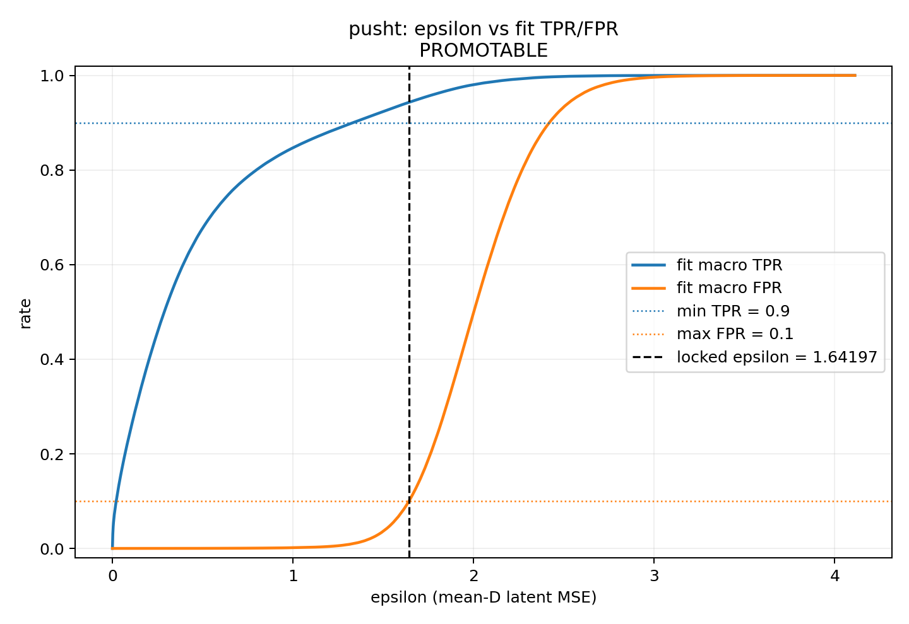
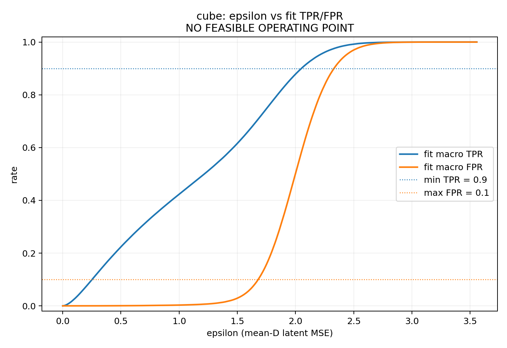
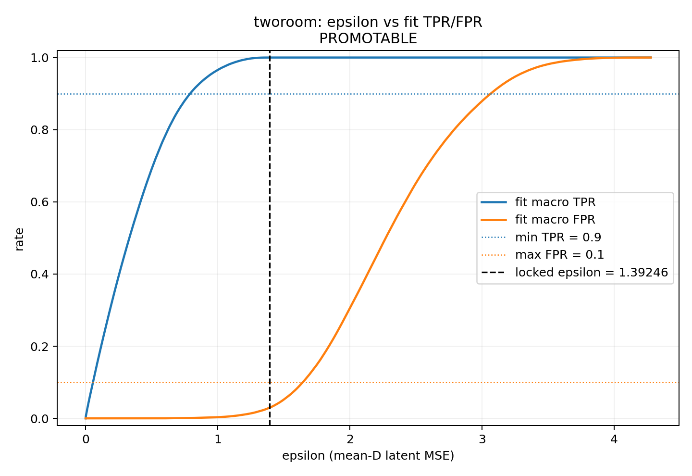
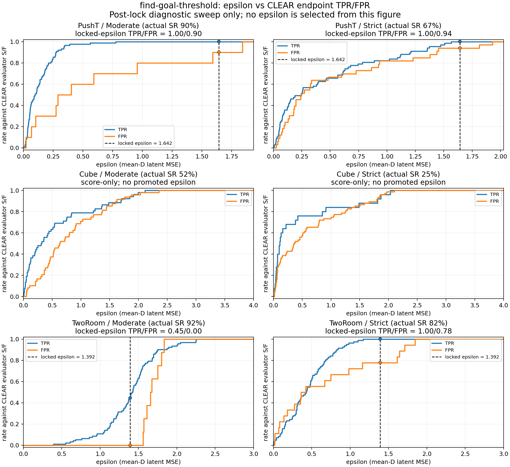

# find-goal-threshold：demo-calibrated goal threshold 正式報告

## 結論

正式實驗使用 immutable commit
`142ffa7156ad79eaefd7f8d757b7ed0e4a6d54ea`，結果如下。

| Task | Pointwise label variant | 找到的 threshold ε | Formal 終態 | Audit macro TPR / FPR | Audit uniform TPR / FPR | Audit population precision |
|---|---|---:|---|---:|---:|---:|
| PushT | `pusht_joint_xy_pointwise_gap20_30` | `1.6419658660888672` | threshold 已鎖定；fit/validation 合約通過 | `0.952936 / 0.100224` | `0.950860 / 0.143495` | `0.008638` |
| Cube | `cube_block_xyz_pointwise_gap03_04` | **沒有可行 threshold** | `THRESHOLD_CALIBRATION_NO_FEASIBLE_OPERATING_POINT` | audit 未開啟 | audit 未開啟 | audit 未開啟 |
| TwoRoom | `tworoom_agent_xy_pointwise_gap8_16` | `1.392462968826294` | threshold 已鎖定；fit/validation 合約通過 | `1.000000 / 0.028177` | `1.000000 / 0.065225` | `0.228997` |

## Epsilon–TPR/FPR curves

以下三張圖以 ε 為 x 軸、fit split 的 anchor-group macro TPR/FPR 為 y
軸。虛線是預註冊的 `TPR >= 0.90`、`FPR <= 0.10` 約束；PushT 與
TwoRoom 的黑色垂直線是鎖定 ε。Cube 沒有畫垂直線，因為它沒有通過合約
的 ε。每張圖旁的 `curve_manifest.json` 都 hash-lock 來源 config、status、
fit score shards、threshold（若有）與 PNG。

Cube 的正式結論不是缺少實驗，而是在要求
`macro-TPR >= 0.90` 且 `macro-FPR <= 0.10` 的預註冊 operating
contract 下不存在可行 ε；在 FPR 約束內可達到的最佳 macro-TPR 為
`0.7078820482`。規格中的 label gap 與 operating constraints 沒有被放寬，
也沒有為了產生數字而開啟 audit 或重新選 threshold。

## PushT 解讀

PushT 在 fit 選出的 ε 為 `1.6419658660888672`：

| Split | Macro TPR | Macro FPR | Uniform TPR | Uniform FPR |
|---|---:|---:|---:|---:|
| Fit | `0.943112` | `0.099999` | `0.946735` | `0.143844` |
| Validation | `0.954280` | `0.098155` | `0.953750` | `0.150354` |
| Audit | `0.952936` | `0.100224` | `0.950860` | `0.143495` |

一次性 audit 的 macro-FPR 點估計為 `0.1002238`，比 0.10 高
`0.0002238`；10,000 次 source-group clustered bootstrap 的 95% CI 是
`[0.091592, 0.108988]`。因此這個 ε 確實通過預註冊的 fit/validation
選擇與 promotion gate，但 audit 顯示它在 10% FPR 邊界上，不能宣稱在
所有 split 都穩健低於 10%。audit 開啟後沒有重調 ε。

PushT 的 uniform population 中 T prevalence 僅約 `0.00131`，所以即使
TPR 約 0.95，audit population precision 仍只有 `0.00864`。這是 base-rate
結果，不應用 stratified-pair precision 取代。

## TwoRoom 解讀

TwoRoom 在 fit 選出的 ε 為 `1.392462968826294`：

| Split | Macro TPR | Macro FPR | Uniform TPR | Uniform FPR |
|---|---:|---:|---:|---:|
| Fit | `1.000000` | `0.029390` | `1.000000` | `0.066920` |
| Validation | `1.000000` | `0.027474` | `1.000000` | `0.065057` |
| Audit | `1.000000` | `0.028177` | `1.000000` | `0.065225` |

Audit macro-TPR 的 clustered 95% CI 為 `[1.000000, 1.000000]`，
macro-FPR CI 為 `[0.027207, 0.029153]`。這個 threshold 在三個 split
都保留很大的預註冊 operating margin。

## CLEAR endpoint self-eval（post-lock）

Self-eval 使用 source commit
`d0c466ba333d98f4b8aaae2b50cd0b86eddaf8d4`，對每個可用 threshold
各跑 CLEAR v0.5 Moderate 與 Strict 的固定 seed-42、100-pair manifest。
實際 S/F 由 CLEAR evaluator 回傳；每個 pair 結束後，再用同一 checkpoint
的 frozen encoder/projector 計算 final observation 到 goal 的
`mean_D((z_final-z_goal)^2)`，並以 `distance <= epsilon` 預測 S/F。

| Task | CLEAR rule | ε | Actual SR | ε-predicted SR | Predicted−actual SR [paired bootstrap 95% CI] | Pair accuracy [Wilson 95% CI] | TP/TN/FP/FN |
|---|---|---:|---:|---:|---:|---:|---:|
| PushT | Moderate | `1.641965866` | `90%` | `99%` | `+9 pp [4, 15]` | `0.91 [0.838, 0.952]` | `90/1/9/0` |
| PushT | Strict | `1.641965866` | `67%` | `98%` | `+31 pp [22, 40]` | `0.69 [0.594, 0.772]` | `67/2/31/0` |
| TwoRoom | Moderate | `1.392462969` | `92%` | `41%` | `−51 pp [−61, −41]` | `0.49 [0.394, 0.587]` | `41/8/0/51` |
| TwoRoom | Strict | `1.392462969` | `82%` | `96%` | `+14 pp [8, 21]` | `0.86 [0.779, 0.915]` | `82/4/14/0` |

主要結論是：目前 ε **不能可靠預測 CLEAR evaluation SR**。四個可執行
cell 的 paired SR-error CI 都不含 0；即使 PushT Moderate 或 TwoRoom
Strict 的 pair accuracy 看起來較高，predicted SR 仍分別高估 9 與 14 個
百分點，而且 class imbalance 使 accuracy 高估了失敗辨識能力。

錯誤方向符合預註冊語義邊界：

- PushT 的 pointwise calibration 忽略角度與 sustained success，因此
  Moderate/Strict 都以 false positive 為主，Strict 更嚴重。
- TwoRoom 的 ε 是以 `<8 px` positive gap 校準；Moderate evaluator 使用
  `<16 px`，因此出現 51 個 false negative。Strict 雖同樣是 8 px 距離，
  仍要求 goal side、合法 route 與 collision semantics，因此有 14 個
  false positive。

完整矩陣狀態是 **INCOMPLETE**，不能稱為正式三 task self-eval：Cube 的
calibration 結論是沒有 promotable ε，所以 `cube/moderate` 與
`cube/strict` 都是 `THRESHOLD_UNAVAILABLE`，沒有拿 failed-fit diagnostic
point 代替。逐 pair distance、S/F、prediction、confusion、hash 與結果位於
`results/find-goal-threshold/self-eval/self-eval-d0c466b-20260821-available-thresholds/`。

前一個 `91aea84` run 因後續加入 paired-bootstrap uncertainty 而被本次
結果取代，但保留為 historical provenance。兩次之間只有 PushT Strict 有
2 個 evaluator S/F flips；四個 cell 的 ε prediction 都沒有 flip。這是
GPU/CEM runtime drift，不是 threshold retuning。

## Epsilon–endpoint TPR/FPR curves（3 tasks x 2 CLEAR rules）

下圖在每個 100-pair cell 內，對所有觀察到的 endpoint-distance breakpoints
掃描非負 ε。`distance <= epsilon` 是 predicted success；CLEAR evaluator
S/F 定義 positive/negative class，因此藍線是 evaluator successes 的 TPR，
橘線是 evaluator failures 的 FPR。六個 panel 各自報告、不 pooling。

| Task | CLEAR rule | Actual SR | Locked ε | TPR / FPR at locked ε | Plot ε range |
|---|---|---:|---:|---:|---:|
| PushT | Moderate | `90%` | `1.641965866` | `1.000 / 0.900` | `[0, 1.933]` |
| PushT | Strict | `67%` | `1.641965866` | `1.000 / 0.939` | `[0, 2.026]` |
| Cube | Moderate | `52%` | — | — | **`[0, 4]`** |
| Cube | Strict | `25%` | — | — | **`[0, 4]`** |
| TwoRoom | Moderate | `92%` | `1.392462969` | `0.446 / 0.000` | **`[0, 3]`** |
| TwoRoom | Strict | `82%` | `1.392462969` | `1.000 / 0.778` | **`[0, 3]`** |

Cube 的顯示範圍已延伸到 4，TwoRoom 延伸到 3；超過該 cell 最大 observed
distance 後，所有 endpoints 都被判為成功，因此 TPR/FPR 維持 `1/1`。
PushT/TwoRoom 標出原本已鎖定的 ε；Cube 只記錄 score curves，沒有垂直線、
沒有選擇或套用 ε。

曲線資料矩陣是完整 3x2，但 fixed-threshold self-eval 仍然不完整：Cube
沒有 promoted ε，所以圖中沒有 Cube 垂直線，也沒有 Cube 的正式
fixed-ε prediction/confusion。這裡的 TPR/FPR 是 CLEAR endpoint evaluator-
relative rates，不是 calibration fit split 的 anchor-group macro TPR/FPR。
它仍是 post-lock descriptive diagnostic，不能用曲線反選或重調 ε。舊的
pair-accuracy PNG 保留為 historical derived artifact，不再是本報告主圖。

## 固定合約與 provenance

- 每個 task 都實現 `100,000,000` 個 latent-blind uniform pairs 加
  `20,000,000` 個 task-space stratified pairs；fit/validation/audit
  分別為 60%/20%/20%，target 與 realized counts 完全相同。
- residual 固定為 `mean_D((z_i-z_j)^2)`，`D=192`、`float32`；每個
  threshold 僅適用於其 task、pointwise label variant、dataset、checkpoint、
  preprocessing 與 compatibility signature。
- encoder/projector 在正式執行前後的 parameter hash 完全相同；
  `planner`、`predictor`、`action_encoder`、environment construction/step
  的 forbidden-call counts 全為 0。
- PushT threshold file SHA-256：
  `5dc633561a94928eb37dcf2506423ba58c8cf35994cf3e8d7a74867880ae98fb`。
- TwoRoom threshold file SHA-256：
  `e2b00f0b38f42b37373e8d4576d915d0140943f5f8b0d0569d61f5b3b41ece4d`。
- 正式 root：
  `/public/home/xsy0001/workspace/data/stable-worldmodel/experiments/observation_goal_threshold/formal-142ffa7-20260820`。
- 完整 remote artifacts（pair manifests、all score rows、fit/validation/audit
  metrics、bootstrap arrays、plots、reports、locks）都保留在上述 root。

### Dataset 與 checkpoint SHA-256

| Task | Dataset SHA-256 | Project-trained checkpoint SHA-256 |
|---|---|---|
| PushT | `b6ebd9ac94bbe9e383f6e7a9cd92d74e9aa665ea57b758ed3717b0ee7df8d4fb` | `e4f14a2276918bcb34876fb8d86d16dbd8683ae6077a13a2275dee008a68c775` |
| Cube | `0664d507c4ff12009010644c9ae950836f954e700c172ccf22e7423af1a55625` | `eece65ce87e451d8ee953d83da0c566f77ad2d8f8f6ee5e77f7ddbae5bedf883` |
| TwoRoom | `129a36aa93ea0de488d2bcc876e396de9e3907bf66c6aae6394e542ef6a6d623` | `68e6ca32ec5f7bdfb728ef89164ab62f566147e7724b74e5cf8e5858db746a65` |

這三個 checkpoint 都是目前可用的 project-trained、seed-3072、從固定 D0
offline split 由零訓練的 canonical M0。舊規格指向的 `/ssd` full-demo
checkpoint 已不存在，因此這是報告中明示的 compatibility fallback，不是
官方 HF checkpoint。

## 測試與失敗保留

- 修正版 remote 全 repository suite：`1102 passed, 11 skipped, 1 xfailed`。
- Self-eval parent revision 的 remote 全套測試：
  `1106 passed, 11 skipped, 1 xfailed`；primary `d0c466b` 的 targeted
  self-eval/CLEAR suite 為 `55 passed`。
- Epsilon–pair-accuracy revision `fb37755` 的 remote targeted suite 為
  `61 passed`，remote 全 repository suite 為
  `1113 passed, 11 skipped, 1 xfailed`；六面板 PNG 已做原始解析度視覺檢查。
- Endpoint TPR/FPR renderer revision `c507b05` 的 remote targeted suite 為
  `62 passed`；Cube `[0,4]`、TwoRoom `[0,3]` 的六面板 PNG 已做原始解析度
  視覺檢查。
- 實驗專屬測試包含 state contracts、group-first split、latent-blind sampling、
  no-replacement refill、exact preprocessing parity、selection/validation、
  clustered bootstrap 與 audit-lock guard。
- 首次 formal root
  `/public/home/xsy0001/workspace/data/stable-worldmodel/experiments/observation_goal_threshold/formal-2d4f13d-20260820`
  保留為失敗 provenance。該版 PushT 在 6,000,000 個 unique pairs 目標下只
  得到 5,996,879；修正版沿用同一預註冊 RNG stream 增量補抽並重新去重，
  而不是換 seed 或複製 pairs。所有 task 隨後在新 commit、新 root 從零重跑，
  沒有沿用失敗 root 的 partial outputs。

## 能支持與不能支持的主張

Calibration 主結果支持的是 frozen project-trained encoder/projector 的
pointwise latent geometry threshold，不是 predictor、reachability 或
planner 證據。Post-lock self-eval 的四個 cells 是正常 CLEAR execution，
但它們檢驗的是 endpoint predicate 與 evaluator 的 paired agreement；不能
把 ε 的高 pair accuracy 當成 planner quality，也不能把缺少 Cube ε 的矩陣
說成完整三 task fixed-threshold 結果。六個 cells 的 endpoint TPR/FPR
curves 現在是完整的，但 Cube 兩格只是 score-only descriptive sweep，不能
用曲線補造 ε 或改寫原本的 calibration failure。
